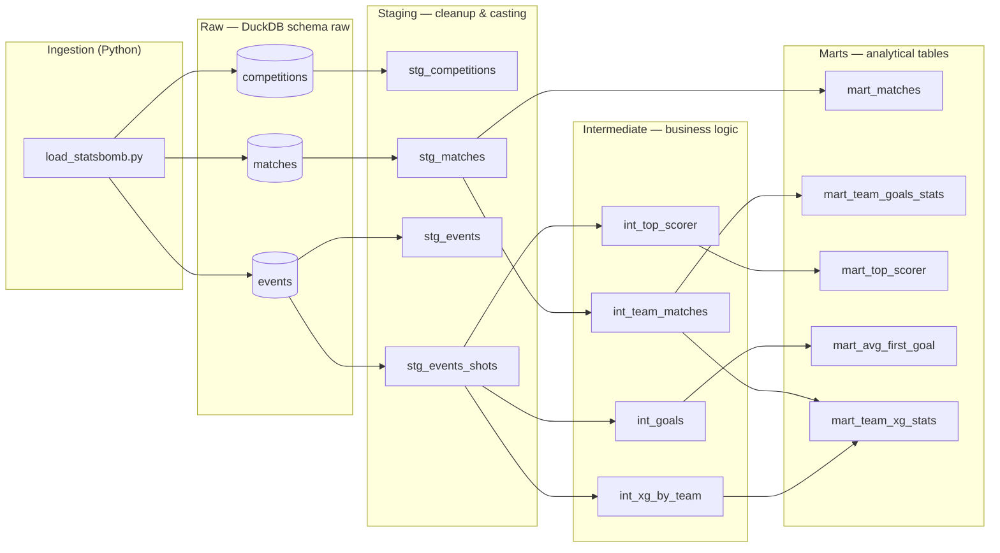

# ⚽ Football Data Warehouse — Qatar 2022

End-to-end data pipeline built on [StatsBomb](https://github.com/statsbomb/open-data) open data from the **2022 FIFA World Cup**. Raw event-level data (234K+ events, 64 matches) is ingested into DuckDB and transformed through a Medallion architecture using dbt, with Apache Airflow orchestrating the full pipeline on a daily schedule.

A portfolio project demonstrating Data Engineering fundamentals: source ingestion, layered transformation, data quality testing, and pipeline orchestration — all running locally with minimal setup.

---

## Tech Stack

| Tool | Role |
|---|---|
| **Python 3.12 + uv** | Core language and dependency management |
| **statsbombpy** | Client library for StatsBomb's open data API |
| **DuckDB** | Embedded OLAP engine — the local data warehouse |
| **dbt-duckdb** | Transformation framework: models, tests, and lineage docs |
| **Apache Airflow** | Pipeline orchestration via Docker Compose |
| **Docker Compose** | Airflow runtime environment |

---

## Architecture

The pipeline has two entry points — run it manually or let Airflow handle it on a schedule.

```
┌─────────────────────────────────────────────────────────────────┐
│  Airflow DAG: football_pipeline  (daily)                        │
│                                                                 │
│   load_statsbomb  ──►  dbt run  ──►  dbt test                  │
└─────────────────────────────────────────────────────────────────┘
```

Data flows through three dbt layers on top of a `raw` schema in DuckDB:



### Layer descriptions

- **Raw**: tables as delivered by StatsBomb, loaded as-is into DuckDB. No transformations here — complex columns (e.g. JSON arrays like `location`) are stored as strings and cleaned downstream.
- **Staging** *(materialized as views)*: one view per source table. Selects and renames columns, applies minimal filters (`stg_events_shots` keeps only `type = 'Shot'`), and casts to correct types. This is the only layer that reads from `source()`.
- **Intermediate** *(materialized as views)*: reusable business-logic building blocks. `int_team_matches` unpivots matches to one row per team; `int_goals` filters shots to goals only; `int_xg_by_team` aggregates shot volume and cumulative xG per team.
- **Marts** *(materialized as tables)*: flat, aggregated, and directly queryable — no joins needed by the consumer. Persisted as physical tables so query performance is consistent regardless of upstream complexity.

**28 data quality tests** cover uniqueness and not-null constraints across all staging models.

---

## Setup & Usage

### Prerequisites

- Python 3.12+
- [`uv`](https://docs.astral.sh/uv/getting-started/installation/)
- Docker + Docker Compose (only needed for Airflow)

### Option A — Run manually

**1. Clone and install dependencies**

```bash
git clone https://github.com/<your-username>/football-dw.git
cd football-dw
uv sync
```

**2. Run the ingestion**

Downloads competitions, matches, and ~234K events from the 2022 World Cup into `data/football.duckdb`.

> Downloading events match by match takes 3–8 minutes depending on your connection.

```bash
uv run python ingestion/load_statsbomb.py
```

**3. Run dbt**

```bash
cd football_dw
uv run dbt run --profiles-dir ~/.dbt
uv run dbt test --profiles-dir ~/.dbt
```

> Note: the `--profiles-dir` flag is needed because a `profiles.yml` is also 
> included inside `football_dw/` for Docker/Airflow usage. When running locally, 
> this flag ensures dbt uses your local profile.

**4. (Optional) Browse the lineage graph**

```bash
uv run dbt docs generate
uv run dbt docs serve
```

Open `http://localhost:8080` to explore the interactive DAG and model documentation.

---

### Option B — Run with Airflow (Docker Compose)

This spins up a full Airflow environment and runs the pipeline automatically on a daily schedule.

**1. Start Airflow**

```bash
cd airflow
docker compose up -d
```

**2. Open the Airflow UI**

Navigate to `http://localhost:8080`. Default credentials: `airflow` / `airflow`.

**3. Trigger the DAG**

Find `football_pipeline` and trigger it manually, or wait for the daily schedule. The DAG runs three tasks in sequence:

```
load_statsbomb  →  dbt_run  →  dbt_test
```

**4. Shut down**

```bash
docker compose down
```

---

## Marts

| Mart | Question it answers |
|---|---|
| `mart_matches` | What was the result of each match, and who won? |
| `mart_team_goals_stats` | How many goals did each team score and concede across the tournament? |
| `mart_top_scorer` | Who were the top scorers, ranked by total goals? |
| `mart_avg_first_goal` | On average, at what minute does the first goal fall in a World Cup match? |
| `mart_team_xg_stats` | How efficient was each team at converting their expected goals into actual goals? |

---

## dbt Lineage Graph


---

## Project Structure

```
football-dw/
├── airflow/
│   ├── dags/
│   │   └── football_pipeline.py   # Airflow DAG: ingestion → dbt run → dbt test
│   ├── docker-compose.yaml
│   └── requirements.txt
├── ingestion/
│   └── load_statsbomb.py          # Downloads StatsBomb data into DuckDB
├── football_dw/                   # dbt project
│   └── models/
│       ├── staging/               # Source cleanup (4 models)
│       ├── intermediate/          # Business logic (4 models)
│       └── marts/                 # Analytical tables (5 models)
├── data/
│   └── football.duckdb            # Local warehouse (not versioned)
├── notebooks/                     # Ad-hoc exploration with JupyterLab
└── pyproject.toml
```

---

## Roadmap

- [ ] **Claude API agent**: a conversational agent that queries DuckDB marts in natural language — "Who was the top scorer?" — generating and running SQL against the warehouse on the fly.
- [ ] **More competitions**: extend ingestion to load other StatsBomb open-data competitions (Champions League, Euros, etc.), handling composite primary keys for competition + season.

---

## Data

All data is publicly available under the [StatsBomb Open Data license](https://github.com/statsbomb/open-data/blob/master/LICENSE.pdf).
