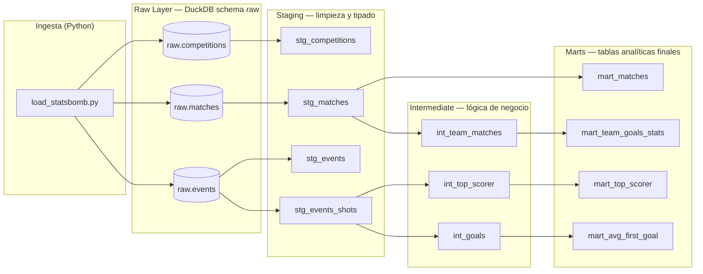

# ⚽ Football Data Warehouse — Qatar 2022

Data warehouse construido sobre los datos abiertos de [StatsBomb](https://github.com/statsbomb/open-data) del **Mundial de Qatar 2022**. El objetivo es modelar esos datos crudos en capas analíticas usando el patrón Medallion (raw → staging → intermediate → marts), aprovechando dbt para las transformaciones y DuckDB como motor de análisis embebido.

Proyecto de portfolio orientado a mostrar buenas prácticas de Data Engineering: separación de capas, linaje de datos, testing declarativo con dbt y gestión de dependencias moderna con `uv`.

---

## Stack tecnológico

| Herramienta | Rol |
|---|---|
| **Python 3.12+** | Lenguaje base |
| **uv** | Gestión de entorno virtual y dependencias |
| **statsbombpy** | Librería oficial para consumir la API abierta de StatsBomb |
| **DuckDB** | Motor OLAP embebido (archivo `.duckdb` local) |
| **dbt-duckdb** | Framework de transformación — modela, prueba y documenta |

---

## Arquitectura

El proyecto sigue el **patrón Medallion** en tres capas dentro de dbt, sobre un schema `raw` cargado por el script de ingestión.



### Descripción de cada capa

- **Raw**: tablas crudas tal como las entrega StatsBomb, cargadas con `statsbombpy` a un archivo DuckDB local.
- **Staging**: una vista por tabla fuente que selecciona y renombra columnas, aplica filtros básicos (`stg_events_shots` filtra solo eventos tipo `Shot`) y establece los tipos correctos.
- **Intermediate**: modelos de lógica de negocio reutilizables. Por ejemplo, `int_team_matches` desnormaliza los partidos para tener una fila por equipo (local y visitante), e `int_goals` aísla solo los disparos que terminaron en gol.
- **Marts**: tablas listas para consumo analítico, sin lógica compleja: agregaciones y rankings directamente consultables.

---

## Instalación y uso

### Prerequisitos

- Python 3.12+
- [`uv`](https://docs.astral.sh/uv/getting-started/installation/) instalado

### 1. Clonar el repositorio

```bash
git clone https://github.com/<tu-usuario>/football-dw.git
cd football-dw
```

### 2. Crear el entorno e instalar dependencias

```bash
uv sync
```

Esto crea automáticamente el `.venv` e instala todo lo declarado en `pyproject.toml`.

### 3. Correr la ingestión

Descarga los datos abiertos de StatsBomb (competencias, partidos y ~3.5M eventos del Mundial 2022) y los carga en un archivo DuckDB local en `data/football.duckdb`.

> La descarga de eventos partido por partido tarda entre 3 y 8 minutos dependiendo de la conexión.

```bash
uv run python ingestion/load_statsbomb.py
```

### 4. Ejecutar los modelos dbt

```bash
cd football_dw
uv run dbt run
```

Para correr también los tests de calidad de datos:

```bash
uv run dbt test
```

### 5. (Opcional) Explorar la documentación de dbt

```bash
uv run dbt docs generate
uv run dbt docs serve
```

Abre `http://localhost:8080` para ver el grafo de linaje interactivo y la documentación de cada modelo.

---

## Modelos finales (Marts)

| Mart | Qué responde |
|---|---|
| `mart_matches` | Resultados de cada partido con el equipo ganador (o `'Empate'`) |
| `mart_team_goals_stats` | Goles a favor, en contra y diferencia de gol por equipo durante todo el torneo |
| `mart_top_scorer` | Ranking de goleadores del torneo con posición numérica |
| `mart_avg_first_goal` | Minuto promedio en que cae el primer gol a lo largo del torneo |

---

## Grafo de linaje (dbt docs)

> _Reemplazar con screenshot de `dbt docs serve`_


---

## Próximos pasos

- [ ] **Airflow**: orquestar la ingestión y el `dbt run` en un DAG programado, para tener el warehouse siempre actualizado sin intervención manual.
- [ ] **Agente con Claude API**: construir un agente conversacional que consulte los marts de DuckDB en lenguaje natural — "¿Quién fue el máximo goleador?" — generando y ejecutando SQL en tiempo real contra el warehouse.
- [ ] **Más competencias**: extender la ingestión para cargar otras competencias del catálogo abierto de StatsBomb (Champions League, Euros, etc.).
- [ ] **Métricas avanzadas**: agregar modelos que expongan xG acumulado por equipo y eficiencia de remate (goles / disparos al arco).

---

## Estructura del proyecto

```
football-dw/
├── ingestion/
│   └── load_statsbomb.py      # Descarga y carga los datos a DuckDB
├── football_dw/               # Proyecto dbt
│   └── models/
│       ├── staging/           # Limpieza de tablas raw
│       ├── intermediate/      # Lógica de negocio reutilizable
│       └── marts/             # Tablas analíticas finales
├── data/
│   └── football.duckdb        # Base de datos local (no versionada)
├── notebooks/                 # Exploración ad-hoc con JupyterLab
└── pyproject.toml             # Dependencias gestionadas con uv
```

---

## Datos

Los datos utilizados son públicos y están distribuidos bajo la licencia de [StatsBomb Open Data](https://github.com/statsbomb/open-data/blob/master/LICENSE.pdf).
