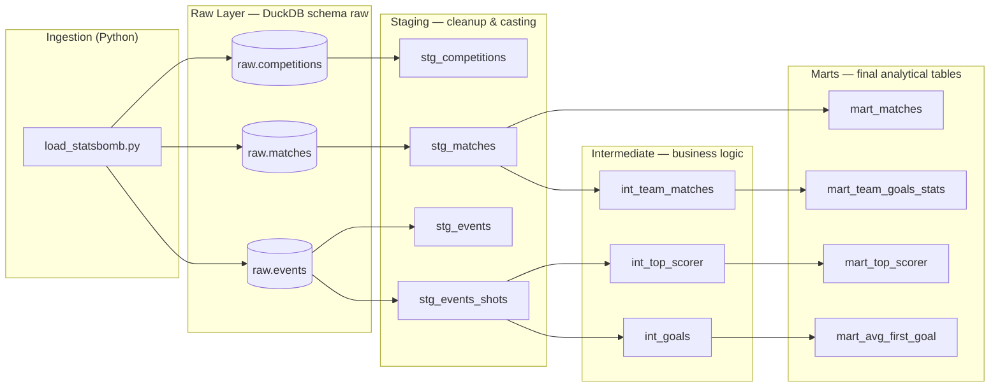
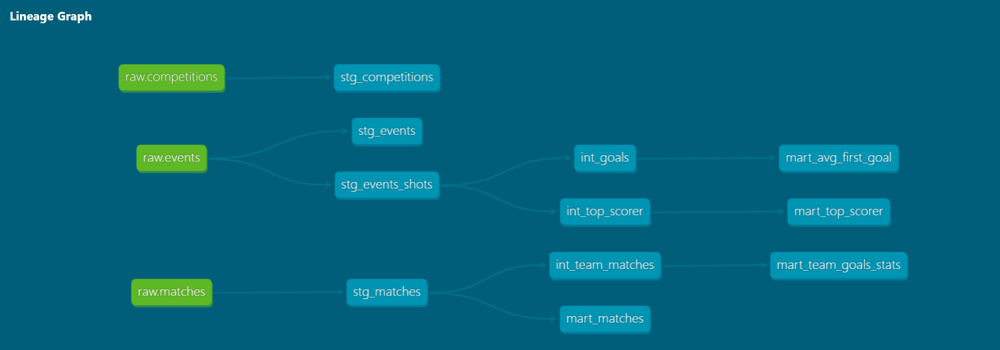

# ⚽ Football Data Warehouse — Qatar 2022

Data warehouse built on [StatsBomb](https://github.com/statsbomb/open-data) open data from the **2022 FIFA World Cup**. The goal is to model raw data into analytical layers using the Medallion pattern (raw → staging → intermediate → marts), leveraging dbt for transformations and DuckDB as the embedded analytics engine.

A portfolio project showcasing Data Engineering best practices: layer separation, data lineage, declarative testing with dbt, and modern dependency management with `uv`.

---

## Tech Stack

| Tool | Role |
|---|---|
| **Python 3.12+** | Core language |
| **uv** | Virtual environment and dependency management |
| **statsbombpy** | Official library for consuming StatsBomb's open API |
| **DuckDB** | Embedded OLAP engine (local `.duckdb` file) |
| **dbt-duckdb** | Transformation framework — models, tests, and docs |

---

## Architecture

The project follows the **Medallion pattern** across three dbt layers, built on top of a `raw` schema populated by the ingestion script.



### Layer descriptions

- **Raw**: raw tables as delivered by StatsBomb, loaded via `statsbombpy` into a local DuckDB file.
- **Staging**: one view per source table that selects and renames columns, applies basic filters (`stg_events_shots` keeps only `Shot` events), and enforces correct types.
- **Intermediate**: reusable business-logic models. For example, `int_team_matches` unpivots matches to one row per team (home and away), and `int_goals` isolates only shots that resulted in a goal.
- **Marts**: consumption-ready tables with no complex logic — aggregations and rankings that can be queried directly.

---

## Setup & Usage

### Prerequisites

- Python 3.12+
- [`uv`](https://docs.astral.sh/uv/getting-started/installation/) installed

### 1. Clone the repository

```bash
git clone https://github.com/<your-username>/football-dw.git
cd football-dw
```

### 2. Create the environment and install dependencies

```bash
uv sync
```

This automatically creates the `.venv` and installs everything declared in `pyproject.toml`.

### 3. Run the ingestion

Downloads StatsBomb open data (competitions, matches, and ~3.5M events from the 2022 World Cup) and loads them into a local DuckDB file at `data/football.duckdb`.

> Downloading events match by match takes between 3 and 8 minutes depending on your connection.

```bash
uv run python ingestion/load_statsbomb.py
```

### 4. Run the dbt models

```bash
cd football_dw
uv run dbt run
```

To also run data quality tests:

```bash
uv run dbt test
```

### 5. (Optional) Browse dbt documentation

```bash
uv run dbt docs generate
uv run dbt docs serve
```

Open `http://localhost:8080` to explore the interactive lineage graph and documentation for every model.

---

## Final Models (Marts)

| Mart | What it answers |
|---|---|
| `mart_matches` | Match results with the winning team (or a draw label) |
| `mart_team_goals_stats` | Goals scored/conceded and goal difference per team across the tournament |
| `mart_top_scorer` | Ranked tournament top scorers with numeric position |
| `mart_avg_first_goal` | Average minute at which the first goal falls across all matches |

---

## dbt Lineage Graph



---

## Roadmap

- [ ] **Airflow**: orchestrate the ingestion and `dbt run` in a scheduled DAG for a hands-free, always-up-to-date warehouse.
- [ ] **Claude API agent**: a conversational agent that queries DuckDB marts in natural language — "Who was the top scorer?" — generating and running SQL against the warehouse on the fly.
- [ ] **More competitions**: extend ingestion to load other StatsBomb open-data competitions (Champions League, Euros, etc.).
- [ ] **Advanced metrics**: add models exposing cumulative xG per team and shot efficiency (goals / shots on target).

---

## Project Structure

```
football-dw/
├── ingestion/
│   └── load_statsbomb.py      # Downloads and loads data into DuckDB
├── football_dw/               # dbt project
│   └── models/
│       ├── staging/           # Raw table cleanup
│       ├── intermediate/      # Reusable business logic
│       └── marts/             # Final analytical tables
├── data/
│   └── football.duckdb        # Local database (not versioned)
├── notebooks/                 # Ad-hoc exploration with JupyterLab
└── pyproject.toml             # Dependencies managed with uv
```

---

## Data

All data used is publicly available under the [StatsBomb Open Data license](https://github.com/statsbomb/open-data/blob/master/LICENSE.pdf).
